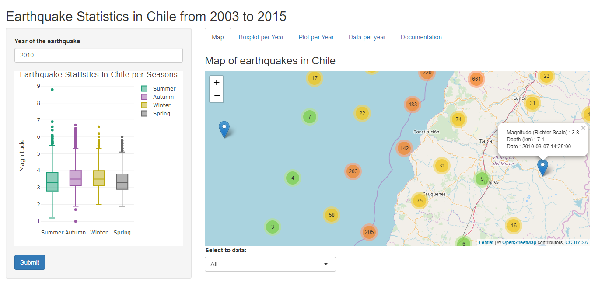

Earthquake Statistics in Chile from 2003 to 2015
========================================================
author: Carlos Saquel
date: 22-11-2018
autosize: true

Introduction
========================================================
In sismology.cl you can review all the earthquakes that occurred in Chile since 2003, in the following link they compiled the data with earthquakes between 2003 to 2005 in the site:

<http://benjad.github.io/2015/08/21/base-de-datos-sismos-chile/>.

The application presented shows the data of the earthquakes that occurred in
Chile between 2003 and 2015. It relates magnitude values of earthquakes 
with selected locations and time periods.

Earthquake Statistics in Chile from 2003 to 2015

Data set
========================================================
The data was processed with the code quakeData.R, which generates the data
requested for quake.csv, which is used for the development of this Shiny
application.

The processed data has the following structure:

|Date                |  lat  |  lng  | Depth | Magnitude |Ref                      |Seasons | Year |
|:-------------------|:-----:|:-----:|:-----:|:---------:|:------------------------|:-------|:----:|
|2010-02-27 03:34:00 | -36,3 | -73,2 | 30,1  |    8,8    |44 km al O de Cobquecura |Summer  | 2010 |
|2014-04-01 20:46:00 | -19,6 | -70,9 | 38,9  |    8,2    |73 km al O de Pisagua    |Autumn  | 2014 |

Earthquake Statistics in Chile from 2003 to 2015

Aplication
========================================================
The application has a side panel where you can select the year in which you want to see the earthquakes, showing a box for each station and different graphics on each of the tabs (in the main panel).

</img>

Earthquake Statistics in Chile from 2003 to 2015

Links
========================================================
The original data can be downloaded from:

http://benjad.github.io/assets/sismos.csv

The codes to process the data (quakeData.R), the application and presentation are in:

<https://github.com/desareca/Especializacion-Data-Science_JHU/tree/master/Developing%20Data%20Products/Shiny%20App>
      

The application in Shiny is found in:

https://desareca.shinyapps.io/Earthquake/

Earthquake Statistics in Chile from 2003 to 2015

