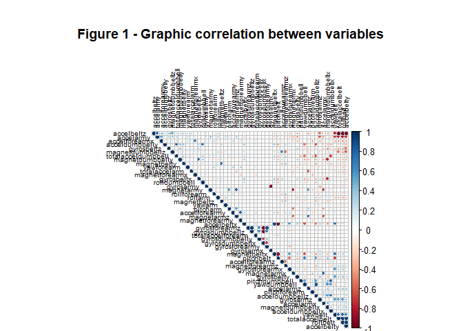

# Introduction

Research on the recognition of human activity has traditionally focused on discriminating between different activities. However, research on "how (well)" has received little attention so far, although it potentially provides useful information for a wide variety of applications, such as sports training http://groupware.les.inf.puc-rio.br/har.

For the prediction of how the individuals performed the assigned exercise, six young health participants were asked to perform a series of 10 repetitions of unilateral dumbbell biceps flexion in five different ways: exactly according to the specification (**Class A**), throwing the elbows at the front (**Class B**), raise the dumbbell only halfway (**Class C**), lower the dumbbell only halfway (**Class D**) and throw the hips forward (**Class E**).

The purpose of this report is to use machine learning algorithms to predict the kind of exercise that individuals were doing by using measurements available on devices such as Jawbone Up, Nike FuelBand and Fitbit.


# Data cleaning
## Loading data

To begin we download the data. There are 2 data sets that are downloaded from the following links:

-  **train set:** https://d396qusza40orc.cloudfront.net/predmachlearn/pml-training.csv
- **test set:** https://d396qusza40orc.cloudfront.net/predmachlearn/pml-testing.csv

```r
library(caret)
library(corrplot)
library(knitr)
library(dplyr)
library(tidyr)
```

```r
# TrainURL <- "https://d396qusza40orc.cloudfront.net/predmachlearn/pml-training.csv"
# TestURL <- "https://d396qusza40orc.cloudfront.net/predmachlearn/pml-testing.csv"
# write.csv(read.csv(TrainURL), file = "train.csv")
# write.csv(read.csv(TestURL), file = "test.csv")
training <- read.csv("train.csv")
test <- read.csv("test.csv")
```

```r
dim(training) # dimensions of the train set
```

```
[1] 19622   161
```

```r
dim(test) # dimensions of the test set
```

```
[1]  20 161
```
Now we proceed to the cleaning of the data. We check if there is **NA**, **NAN** or **empty** data. In case of finding, we will eliminate the variables that have more than 95% of their data as **NA**, **NAN** or **empty** data. The other cases in which these values are found are reviewed individually.
In addition, variables that have variance that store to zero will be removed to eviatr that affects the design of the models.


```r
# Count how many NA there are in each variable and filter them if necessary
CountNA <- data.frame(colSums(1*is.na(training)))
CountNotNA <- data.frame(colSums(1*!is.na(training)))
ratioNA <- t(100*(1 - CountNA/(CountNA + CountNotNA)))

training <- training[,ratioNA > 5]
test <- test[,ratioNA > 5]

# Count how many # DIV / 0! and empty data in each variable and filters them if necessary
valMiss <- ((training=="#DIV/0!") + (training==""))>=1
CountMiss <- data.frame(colSums(1*valMiss))
CountNotMiss <- data.frame(colSums(1*!valMiss))
ratioMiss <- t(100*(1 - CountMiss/(CountMiss + CountNotMiss)))

training <- training[,ratioMiss > 5]
test <- test[,ratioMiss > 5]

# Removes hyphens and dots in the names of the variables.
names(training) <- gsub("_","",names(training))
names(training)[1] <- "X1"
names(test) <- gsub("_","",names(test))
names(test)[1] <- "X1"
training <- training[,-1]
test <- test[,-1]

# Eliminate variables with variance close to zero
NZV <- nearZeroVar(training)
training <- training[,-NZV]
test <- test[,-NZV]

# Eliminates variables that are not transcendent for prediction.
training <- training[,-c(1:6)]
test <- test[,-c(1:6)]
dim(training) # dimensions of the training set
```

```
[1] 19622    53
```

```r
dim(test) # dimensions of the test set
```

```
[1] 20 53
```

A correlation analysis is performed between the variables before the modeling work is done. Select "FPC" for the first principal component.


```r
corrplot(cor(training[,-53]), order = "FPC", method = "circle", type = "upper", tl.cex = 0.6, tl.col = rgb(0, 0, 0), title = "Figure 1 - Graphic correlation between variables", mar = c(0, 0, 5, 0))
```

<!-- -->

If two variables are highly correlated, their colors are blue or red (for a positive or negative correlation).
To further reduce the number of variables, a Principal Component Analysis (**PCA**) could be performed, however, since there are only very few strong correlations between the input variables, the **PCA** will not be performed. Instead, several different prediction models will be constructed below.


# Prediction models

## Split of training and test sets.

For the training and testing set, a ratio of 70% of **training** and 30% of **test** is considered.


```r
set.seed(28916022)
Index1 <- createDataPartition(y = training$classe, p = 0.7,
                              list = FALSE)
testing <- training[-Index1,]
training <- training[Index1,]
table <- rbind(prop.table(table(training$classe)), 
               prop.table(table(testing$classe)))
rownames(table) <- c("training", "testing")
round(table,3) # Proportion of the different levels in each data set
```

```
             A     B     C     D     E
training 0.284 0.193 0.174 0.164 0.184
testing  0.284 0.194 0.174 0.164 0.184
```


## Implementation of the model.
### Training.
4 models will be used to predict:

- Linear Discriminant Analysis (**LDA**)
- Quadratic Discriminant Analysis (**QDA**)
- k-Nearest Neighbors (**KNN**)
- Generalized Boosted Regression Modeling (**GBM**)

In addition, a **5-fold (k-fold) cross-validation** is considered: the k-fold cross-validation method consists of dividing the data set into k-subsets. For each subset it is maintained while the model is trained in all other subsets. It is a robust method to estimate the accuracy, and the size of k and adjust the amount of bias in the estimate.


```r
trC=trainControl(method="cv", number=5)
m="Accuracy"

set.seed(2891)
fitLDA <- train(classe~., data=training, method="lda", metric=m,
                trControl=trC)
set.seed(2891)
fitQDA <- train(classe~., data=training, method="qda", metric=m,
                trControl=trC) 
set.seed(2891)
fitGBM <- train(classe~., data=training, method="gbm", metric=m,
                trControl=trC, verbose=FALSE) 
set.seed(2891)
fitKNN <- train(classe~., data=training, method="knn", metric=m,
                trControl=trC)
```

### Testing.

With the models already trained we proceed to make the test predictions and evaluate their performance.


```r
PredLDAtrain<-predict(fitLDA, newdata=training)
PredQDAtrain<-predict(fitQDA, newdata=training)
PredKNNtrain<-predict(fitKNN, newdata=training)
PredGBMtrain<-predict(fitGBM, newdata=training)
PredLDAtest<-predict(fitLDA, newdata=testing)
PredQDAtest<-predict(fitQDA, newdata=testing)
PredKNNtest<-predict(fitKNN, newdata=testing)
PredGBMtest<-predict(fitGBM, newdata=testing)

mSummaryTrain <- cbind(confusionMatrix(PredLDAtrain, training$classe)$overall[1],
                       confusionMatrix(PredQDAtrain, training$classe)$overall[1],
                       confusionMatrix(PredKNNtrain, training$classe)$overall[1],
                       confusionMatrix(PredGBMtrain, training$classe)$overall[1])
colnames(mSummaryTrain) <- c("LDA", "QDA", "KNN", "GBM")
rownames(mSummaryTrain) <- "Training"

mSummaryTest <- cbind(confusionMatrix(PredLDAtest, testing$classe)$overall[1],
                       confusionMatrix(PredQDAtest, testing$classe)$overall[1],
                       confusionMatrix(PredKNNtest, testing$classe)$overall[1],
                       confusionMatrix(PredGBMtest, testing$classe)$overall[1])
colnames(mSummaryTest) <- c("LDA", "QDA", "KNN", "GBM")
rownames(mSummaryTest) <- "Testing"

# Confusion matrix of the fitLDA predictor and the test set
confusionMatrix(PredLDAtest, testing$classe)
```

```
Confusion Matrix and Statistics

          Reference
Prediction    A    B    C    D    E
         A 1363  188  103   71   48
         B   34  727   93   37  197
         C  143  129  693  115   88
         D  126   41  117  703  101
         E    8   54   20   38  648

Overall Statistics
                                          
               Accuracy : 0.7025          
                 95% CI : (0.6906, 0.7141)
    No Information Rate : 0.2845          
    P-Value [Acc > NIR] : < 2.2e-16       
                                          
                  Kappa : 0.6232          
 Mcnemar's Test P-Value : < 2.2e-16       

Statistics by Class:

                     Class: A Class: B Class: C Class: D Class: E
Sensitivity            0.8142   0.6383   0.6754   0.7293   0.5989
Specificity            0.9026   0.9239   0.9022   0.9218   0.9750
Pos Pred Value         0.7688   0.6682   0.5933   0.6461   0.8438
Neg Pred Value         0.9244   0.9141   0.9294   0.9456   0.9152
Prevalence             0.2845   0.1935   0.1743   0.1638   0.1839
Detection Rate         0.2316   0.1235   0.1178   0.1195   0.1101
Detection Prevalence   0.3013   0.1849   0.1985   0.1849   0.1305
Balanced Accuracy      0.8584   0.7811   0.7888   0.8255   0.7870
```

```r
# Confusion matrix of the fitQDA predictor and the test set
confusionMatrix(PredQDAtest, testing$classe)
```

```
Confusion Matrix and Statistics

          Reference
Prediction    A    B    C    D    E
         A 1551   54    0    1    0
         B   69  960   53    2   31
         C   24  115  970  129   53
         D   27    3    2  812   23
         E    3    7    1   20  975

Overall Statistics
                                         
               Accuracy : 0.8952         
                 95% CI : (0.887, 0.9029)
    No Information Rate : 0.2845         
    P-Value [Acc > NIR] : < 2.2e-16      
                                         
                  Kappa : 0.8676         
 Mcnemar's Test P-Value : < 2.2e-16      

Statistics by Class:

                     Class: A Class: B Class: C Class: D Class: E
Sensitivity            0.9265   0.8428   0.9454   0.8423   0.9011
Specificity            0.9869   0.9673   0.9339   0.9888   0.9935
Pos Pred Value         0.9658   0.8610   0.7514   0.9366   0.9692
Neg Pred Value         0.9713   0.9625   0.9878   0.9697   0.9781
Prevalence             0.2845   0.1935   0.1743   0.1638   0.1839
Detection Rate         0.2636   0.1631   0.1648   0.1380   0.1657
Detection Prevalence   0.2729   0.1895   0.2194   0.1473   0.1709
Balanced Accuracy      0.9567   0.9051   0.9397   0.9156   0.9473
```

```r
# Confusion matrix of the fitKNN predictor and the test set
confusionMatrix(PredKNNtest, testing$classe)
```

```
Confusion Matrix and Statistics

          Reference
Prediction    A    B    C    D    E
         A 1606   49   12   18   16
         B   25  993   33    3   52
         C   17   32  921   61   33
         D   18   34   38  872   34
         E    8   31   22   10  947

Overall Statistics
                                          
               Accuracy : 0.9072          
                 95% CI : (0.8995, 0.9145)
    No Information Rate : 0.2845          
    P-Value [Acc > NIR] : < 2.2e-16       
                                          
                  Kappa : 0.8826          
 Mcnemar's Test P-Value : 8.755e-10       

Statistics by Class:

                     Class: A Class: B Class: C Class: D Class: E
Sensitivity            0.9594   0.8718   0.8977   0.9046   0.8752
Specificity            0.9774   0.9762   0.9706   0.9748   0.9852
Pos Pred Value         0.9442   0.8978   0.8656   0.8755   0.9303
Neg Pred Value         0.9837   0.9694   0.9782   0.9812   0.9723
Prevalence             0.2845   0.1935   0.1743   0.1638   0.1839
Detection Rate         0.2729   0.1687   0.1565   0.1482   0.1609
Detection Prevalence   0.2890   0.1879   0.1808   0.1692   0.1730
Balanced Accuracy      0.9684   0.9240   0.9341   0.9397   0.9302
```

```r
# Confusion matrix of the fitGBM predictor and the test set
confusionMatrix(PredGBMtest, testing$classe)
```

```
Confusion Matrix and Statistics

          Reference
Prediction    A    B    C    D    E
         A 1643   26    0    2    1
         B   16 1088   28    3   12
         C   10   23  973   29    8
         D    4    1   22  922    9
         E    1    1    3    8 1052

Overall Statistics
                                          
               Accuracy : 0.9648          
                 95% CI : (0.9598, 0.9694)
    No Information Rate : 0.2845          
    P-Value [Acc > NIR] : < 2.2e-16       
                                          
                  Kappa : 0.9555          
 Mcnemar's Test P-Value : 0.002477        

Statistics by Class:

                     Class: A Class: B Class: C Class: D Class: E
Sensitivity            0.9815   0.9552   0.9483   0.9564   0.9723
Specificity            0.9931   0.9876   0.9856   0.9927   0.9973
Pos Pred Value         0.9827   0.9486   0.9329   0.9624   0.9878
Neg Pred Value         0.9926   0.9892   0.9891   0.9915   0.9938
Prevalence             0.2845   0.1935   0.1743   0.1638   0.1839
Detection Rate         0.2792   0.1849   0.1653   0.1567   0.1788
Detection Prevalence   0.2841   0.1949   0.1772   0.1628   0.1810
Balanced Accuracy      0.9873   0.9714   0.9670   0.9746   0.9848
```

```r
# Comparing accuracy of the training and test set
round(rbind(mSummaryTrain, mSummaryTest),3)
```

```
           LDA   QDA   KNN   GBM
Training 0.704 0.900 0.958 0.975
Testing  0.702 0.895 0.907 0.965
```

```r
# Comparing error of the training and test set
## Error is considered as the sum of the cases in which the prediction differs from the reference,
## divided among all the cases.

errorLDAtrain <- sum(PredLDAtrain!=training$classe)/length(training$classe)
errorQDAtrain <- sum(PredQDAtrain!=training$classe)/length(training$classe)
errorKNNtrain <- sum(PredKNNtrain!=training$classe)/length(training$classe)
errorGBMtrain <- sum(PredGBMtrain!=training$classe)/length(training$classe)

errorLDAtest <- sum(PredLDAtest!=testing$classe)/length(testing$classe)
errorQDAtest <- sum(PredQDAtest!=testing$classe)/length(testing$classe)
errorKNNtest <- sum(PredKNNtest!=testing$classe)/length(testing$classe)
errorGBMtest <- sum(PredGBMtest!=testing$classe)/length(testing$classe)

mError <- rbind(cbind(errorLDAtrain,errorQDAtrain,errorKNNtrain,errorGBMtrain),
                cbind(errorLDAtest,errorQDAtest,errorKNNtest,errorGBMtest))

colnames(mError) <- c("LDA", "QDA", "KNN", "GBM")
rownames(mError) <- c("Training","Testing")

round(mError,3) # Error of the training and test set
```

```
           LDA   QDA   KNN   GBM
Training 0.296 0.100 0.042 0.025
Testing  0.298 0.105 0.093 0.035
```

It is observed that the predictions of the training set have a better precision than those of the test set. In the case of error, the opposite occurs, the error increases in the test set compared with the training set.

In addition, we observe that the model with the best precision and the least error is GBM.

## Testing set Test (pml-testing.csv)

Now we select the GBM model to predict based on the data set "pml-testing.csv".


```r
PredictTest <- predict(fitGBM, newdata=test)

filename = "Results_problem_id.txt"
write.table(PredictTest,file=filename,quote=FALSE,row.names=FALSE,col.names=FALSE)
```
