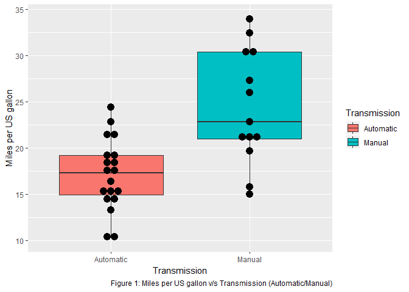
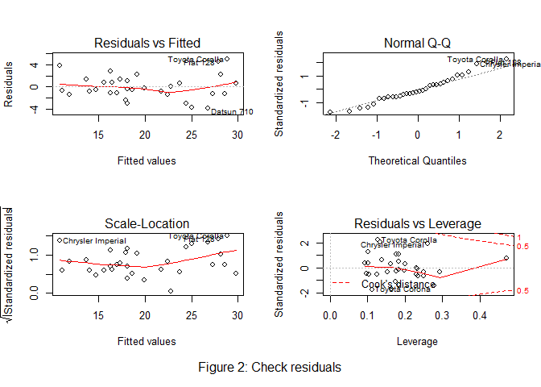

# Executive Summary

Motor Trend, an automobile trend magazine is interested in exploring the relationship between a set of variables and miles per gallon (MPG) outcome. In this project, we will analyze the mtcars dataset from the 1974 Motor Trend US magazine to answer the following questions:

- Is an automatic or manual transmission better for miles per gallon (MPG)?

- How different is the MPG between automatic and manual transmissions?


#Data Description

We analyze the **mtcars** data set through Regression Modelling and exploratory analysis to show how automatic (*am* = 0) and manual (*am* = 1) transmissions features affect the MPG feature.

The data was extracted from the 1974 Motor Trend US magazine, which comprises fuel consumption and 10 aspects of automobile design and performance for 32 automobiles (1973-74 models).

The data set consists of a data frame with 32 observations (nrow) and 11 variables (ncol).

- **mpg**: Miles per US gallon
- **cyl**: Number of cylinders
- **disp**: Displacement (*cubic inches*)
- **hp**: Gross horsepower
- **drat**: Rear axle ratio
- **wt**: Weight (1000 lb)
- **qsec**: 1/4 mile time
- **vs**: Engine (0 = *V-shaped*, 1 = *straight*)
- **am**: Transmission (0 = *automatic*, 1 = *manual*)
- **gear**: Number of forward gears
- **carb**: Number of carburetors


# Exploratory Data Analysis

First we must determine whether or not there really is a difference between automatic and manual transmissions in terms of mpg. For this purpose, a review of the data is made (see *Appendix A.1*)

In the **Figure1** in *Appendix A.1* the boxplot with the information of the mileage vs the transmission is shown. In this diagram you can clearly see that there is a difference in the mileage (*mpg*) depending on the type of transmission (automatic or manual). Where the median mileage (*mpg*) for an automatic transmission is `17.3` and for a manual transmission is `22.8`.


# Multivariable Regression Model

For the analysis we will consider 3 models (see *Appendix A.2*).

- **fit_base**: Regression model between `mpg` and` am`.

- **fit_best**: Regression model between `mpg` the variables determined by the` stepAIC` function.

- **fit_full**: Regression model between `mpg` and all the data set variables.


Once the `fit_best` model has been obtained (*mpg ~ cyl + hp + wt + am*) we will use the` anova` function to determine which of these three models best fits the data with the least possible complexity.


According to the analysis of variance (ver *Apendix A.2*) the p-value is significant, hence we reject the null hypothesis that the variables *cyl*, *hp* and *wt* do not contribute to the accuracy of the model.
We double-check the residuals for non-normality (*Apendix A.2 - Figure 2*) and can see they are all normally distributed and homoskedastic.


```r
d<-data.frame()
d[1,1] <- round(summary(fit_base)$r.squared,4); d[1,2] <- round(summary(fit_best)$r.squared,4)
colnames(d) <- c("fit_base", "fit_best"); rownames(d) <- "R^2^"
knitr::kable(d, align = "c", pading = 3, caption = "Comparacion R^2^ entre modelos")
```


Table: Comparacion R^2^ entre modelos

        fit_base    fit_best 
-----  ----------  ----------
R^2^     0.3598      0.8497  

The model `fit_best` explains 84.96% of the variance and as a result, *cyl*, *hp*, *wt*  did affect the correlation between *mpg* and *am*. Thus, we can say the difference between automatic and manual transmissions is 1.81 MPG.


# Conclusions

Based on the observations of our best fit model, we can conclude:

Considering the summaries of the models, it is observed that the model *fit_best* has a significant difference in the parameters with *fit_base*. For *fit_base*, cars with manual transmission get more miles per gallon compared to automobiles with automatic transmission. (7.25 *mpg* set by *hp*, *cyl*, and *wt*), in the case of *fit_best* is 1.81 in the same conditions.

The *mpg* will decrease by 2.5 (adjusted by *hp*, *cyl* and *am*) for every 1000 pounds of weight. *mpg* decreases negligibly with the increase of *hp*.

If the number of cylinders, *cil* increases from 4 to 6 and 8, *mpg* will decrease by a factor of 3 and 2.2 respectively (set by *hp*, *wt* and *am*).


# Appendix

## A.1 - Data Processing

First we load the data and the libraries.


```r
library(ggplot2); library(dplyr); library(knitr); library(MASS); data(mtcars)
data <- mtcars
```


Then we start with the analysis, review the data taking a sample and see how it is structured (table 2, 3).


```r
knitr::kable(head(data,5), align = "c", caption = "Sample of data set mtcars"); 
```


Table: Sample of data set mtcars

                     mpg     cyl    disp    hp     drat     wt      qsec     vs    am    gear    carb 
------------------  ------  -----  ------  -----  ------  -------  -------  ----  ----  ------  ------
Mazda RX4            21.0     6     160     110    3.90    2.620    16.46    0     1      4       4   
Mazda RX4 Wag        21.0     6     160     110    3.90    2.875    17.02    0     1      4       4   
Datsun 710           22.8     4     108     93     3.85    2.320    18.61    1     1      4       1   
Hornet 4 Drive       21.4     6     258     110    3.08    3.215    19.44    1     0      3       1   
Hornet Sportabout    18.7     8     360     175    3.15    3.440    17.02    0     0      3       2   

```r
a<-list();for (i in 1:dim(data)[2]){a[i]<-class(data[,i])}
knitr::kable(data.frame(t(a)), align = "c", pading = 3, 
             caption = "Class of the data set mtcars")
```


Table: Class of the data set mtcars

   X1         X2         X3         X4         X5         X6         X7         X8         X9         X10        X11   
---------  ---------  ---------  ---------  ---------  ---------  ---------  ---------  ---------  ---------  ---------
 numeric    numeric    numeric    numeric    numeric    numeric    numeric    numeric    numeric    numeric    numeric 


Observing the data, let's adjust the variables **cyl**, **hp**, **am**, **gear** and **carb** which are numeric but should be factor type.


```r
mtcars$cyl <- factor(mtcars$cyl)
mtcars$am <- factor(mtcars$am,labels=c("Automatic","Manual"))
mtcars$vs <- factor(mtcars$vs,labels=c("V-shaped","straight"))
mtcars$gear <- factor(mtcars$gear); mtcars$carb <- factor(mtcars$carb)
```

With this we can compare how the type of transmission (automatic - manual) affects the mileage (*mpg*).


```r
p <- ggplot(mtcars, aes(x=factor(am,labels=c("Automatic","Manual")), y=mpg, 
      fill = factor(am,labels=c("Automatic","Manual")))) + geom_boxplot() +
      geom_dotplot(binaxis='y', stackdir='center', dotsize=1, fill ="black") +
      scale_fill_discrete(name = "Transmission") + xlab("Transmission") + 
      ylab("Miles per US gallon") + labs(caption = 
      "Figure 1: Miles per US gallon v/s Transmission (Automatic/Manual)");p
```

<!-- -->


## A.2 - Multivariable Regression Model and inferences.
**Next, 3 linear models are generated:**


```r
fit_base <- lm(mpg ~ am, data = mtcars)
fit_full <- lm(mpg ~ ., data = mtcars)
fit_best <- stepAIC(fit_full, direction = "both")
```

```
Start:  AIC=76.4
mpg ~ cyl + disp + hp + drat + wt + qsec + vs + am + gear + carb

       Df Sum of Sq    RSS    AIC
- carb  5   13.5989 134.00 69.828
- gear  2    3.9729 124.38 73.442
- am    1    1.1420 121.55 74.705
- qsec  1    1.2413 121.64 74.732
- drat  1    1.8208 122.22 74.884
- cyl   2   10.9314 131.33 75.184
- vs    1    3.6299 124.03 75.354
<none>              120.40 76.403
- disp  1    9.9672 130.37 76.948
- wt    1   25.5541 145.96 80.562
- hp    1   25.6715 146.07 80.588

Step:  AIC=69.83
mpg ~ cyl + disp + hp + drat + wt + qsec + vs + am + gear

       Df Sum of Sq    RSS    AIC
- gear  2    5.0215 139.02 67.005
- disp  1    0.9934 135.00 68.064
- drat  1    1.1854 135.19 68.110
- vs    1    3.6763 137.68 68.694
- cyl   2   12.5642 146.57 68.696
- qsec  1    5.2634 139.26 69.061
<none>              134.00 69.828
- am    1   11.9255 145.93 70.556
- wt    1   19.7963 153.80 72.237
- hp    1   22.7935 156.79 72.855
+ carb  5   13.5989 120.40 76.403

Step:  AIC=67
mpg ~ cyl + disp + hp + drat + wt + qsec + vs + am

       Df Sum of Sq    RSS    AIC
- drat  1    0.9672 139.99 65.227
- cyl   2   10.4247 149.45 65.319
- disp  1    1.5483 140.57 65.359
- vs    1    2.1829 141.21 65.503
- qsec  1    3.6324 142.66 65.830
<none>              139.02 67.005
- am    1   16.5665 155.59 68.608
- hp    1   18.1768 157.20 68.937
+ gear  2    5.0215 134.00 69.828
- wt    1   31.1896 170.21 71.482
+ carb  5   14.6475 124.38 73.442

Step:  AIC=65.23
mpg ~ cyl + disp + hp + wt + qsec + vs + am

       Df Sum of Sq    RSS    AIC
- disp  1    1.2474 141.24 63.511
- vs    1    2.3403 142.33 63.757
- cyl   2   12.3267 152.32 63.927
- qsec  1    3.1000 143.09 63.928
<none>              139.99 65.227
+ drat  1    0.9672 139.02 67.005
- hp    1   17.7382 157.73 67.044
- am    1   19.4660 159.46 67.393
+ gear  2    4.8033 135.19 68.110
- wt    1   30.7151 170.71 69.574
+ carb  5   13.0509 126.94 72.095

Step:  AIC=63.51
mpg ~ cyl + hp + wt + qsec + vs + am

       Df Sum of Sq    RSS    AIC
- qsec  1     2.442 143.68 62.059
- vs    1     2.744 143.98 62.126
- cyl   2    18.580 159.82 63.466
<none>              141.24 63.511
+ disp  1     1.247 139.99 65.227
+ drat  1     0.666 140.57 65.359
- hp    1    18.184 159.42 65.386
- am    1    18.885 160.12 65.527
+ gear  2     4.684 136.55 66.431
- wt    1    39.645 180.88 69.428
+ carb  5     2.331 138.91 72.978

Step:  AIC=62.06
mpg ~ cyl + hp + wt + vs + am

       Df Sum of Sq    RSS    AIC
- vs    1     7.346 151.03 61.655
<none>              143.68 62.059
- cyl   2    25.284 168.96 63.246
+ qsec  1     2.442 141.24 63.511
- am    1    16.443 160.12 63.527
+ disp  1     0.589 143.09 63.928
+ drat  1     0.330 143.35 63.986
+ gear  2     3.437 140.24 65.284
- hp    1    36.344 180.02 67.275
- wt    1    41.088 184.77 68.108
+ carb  5     3.480 140.20 71.275

Step:  AIC=61.65
mpg ~ cyl + hp + wt + am

       Df Sum of Sq    RSS    AIC
<none>              151.03 61.655
- am    1     9.752 160.78 61.657
+ vs    1     7.346 143.68 62.059
+ qsec  1     7.044 143.98 62.126
- cyl   2    29.265 180.29 63.323
+ disp  1     0.617 150.41 63.524
+ drat  1     0.220 150.81 63.608
+ gear  2     1.361 149.66 65.365
- hp    1    31.943 182.97 65.794
- wt    1    46.173 197.20 68.191
+ carb  5     5.633 145.39 70.438
```


**Analysis of variance of the models.**


```r
anova(fit_base, fit_best)
```

<div class="kable-table">

 Res.Df        RSS   Df   Sum of Sq          F   Pr(>F)
-------  ---------  ---  ----------  ---------  -------
     30   720.8966   NA          NA         NA       NA
     26   151.0256    4     569.871   24.52671        0

</div>

**Summary *fit_base* and *fit_best*.**

```r
summary(fit_base)
```

```

Call:
lm(formula = mpg ~ am, data = mtcars)

Residuals:
    Min      1Q  Median      3Q     Max 
-9.3923 -3.0923 -0.2974  3.2439  9.5077 

Coefficients:
            Estimate Std. Error t value Pr(>|t|)    
(Intercept)   17.147      1.125  15.247 1.13e-15 ***
amManual       7.245      1.764   4.106 0.000285 ***
---
Signif. codes:  0 '***' 0.001 '**' 0.01 '*' 0.05 '.' 0.1 ' ' 1

Residual standard error: 4.902 on 30 degrees of freedom
Multiple R-squared:  0.3598,	Adjusted R-squared:  0.3385 
F-statistic: 16.86 on 1 and 30 DF,  p-value: 0.000285
```

```r
summary(fit_best)
```

```

Call:
lm(formula = mpg ~ cyl + hp + wt + am, data = mtcars)

Residuals:
    Min      1Q  Median      3Q     Max 
-3.9387 -1.2560 -0.4013  1.1253  5.0513 

Coefficients:
            Estimate Std. Error t value Pr(>|t|)    
(Intercept) 33.70832    2.60489  12.940 7.73e-13 ***
cyl6        -3.03134    1.40728  -2.154  0.04068 *  
cyl8        -2.16368    2.28425  -0.947  0.35225    
hp          -0.03211    0.01369  -2.345  0.02693 *  
wt          -2.49683    0.88559  -2.819  0.00908 ** 
amManual     1.80921    1.39630   1.296  0.20646    
---
Signif. codes:  0 '***' 0.001 '**' 0.01 '*' 0.05 '.' 0.1 ' ' 1

Residual standard error: 2.41 on 26 degrees of freedom
Multiple R-squared:  0.8659,	Adjusted R-squared:  0.8401 
F-statistic: 33.57 on 5 and 26 DF,  p-value: 1.506e-10
```

**Check residuals**


```r
par(mfrow=c(2,2), oma=c(2,0,0,0))
plot(fit_best)
mtext(side=1,line=0,cex=1, outer=T,"Figure 2: Check residuals")
```

<!-- -->


