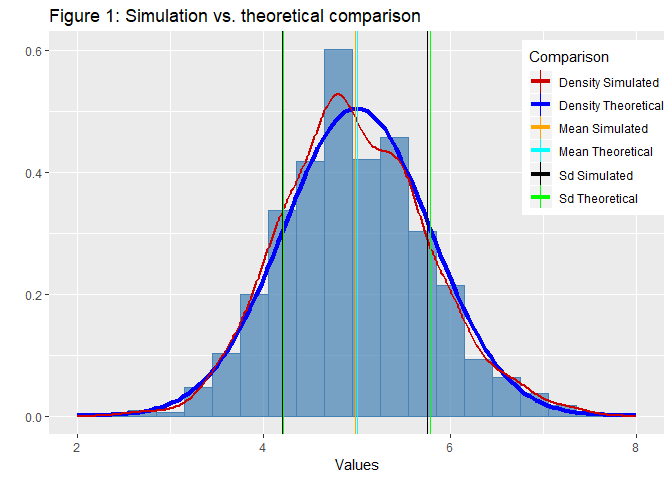
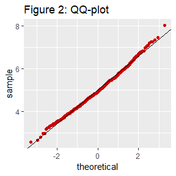

# Description 


In this project you will investigate the exponential distribution in R and compare it with the Central Limit Theorem. The exponential distribution can be simulated in R with `rexp(n, lambda)` where lambda is the rate parameter.


The mean of exponential distribution is $\frac{1}{\lambda}$ and the standard deviation is also $\frac{1}{\lambda}$. Set $\lambda = 0.2$ for all of the simulations. You will investigate the distribution of averages of 40 exponentials. Note that you will need to do a thousand simulations.


# Simulations


This document includes the output of R codes, including text and graphics.


The exponential distribution is simulated in R with `rexp (n, lambda)`, where $\lambda = 0.2$, the sample size is `n = 40`, and the simulation number is 1000. See the first 12 of the data set.


Table: Simulated exponential distribution

 **Exp. distribution (1-6)**    **Exp. distribution (7-12)** 
-----------------------------  ------------------------------
            7.37                            4.23             
            4.52                            5.21             
            3.18                            4.45             
            4.63                            5.36             
            5.40                            4.77             
            4.60                            4.70             


With these data, below is a table of the mean and variance comparing the simulated vs. the theoretical data.


Table: Comparison simulation vs.
      theoretical mean and variance

                **Simulated**    **Theoretical** 
-------------  ---------------  -----------------
**Mean**            4.98              5.00       
**Variance**        0.61              0.62       


The density of the real data is shown by the light blue bars. The theoretical average and the sample mean are so close that they almost overlap. The "blue" line shows the normal curve formed by the theoretical mean and the standard deviation. The "red" line shows the curve formed by the mean of the sample and the standard deviation. As you can see in the graph, the distribution of the exponential averages is close to the normal distribution with the expected theoretical values based on the given lambda.





The Q-Q Normal plot can also be used to indicate the normal distribution of data.





If the data is normally distributed, the points in the QQ-normal plot lie on a straight diagonal line. The deviations from the straight line are minimal. This indicates the sample mean is normal distribution, although the initial sample are not normal distributed.


The normal distribution can also be found from calculating the intervals:


Table: Confidence interval

                   **Simulated**    **Theoretical** 
----------------  ---------------  -----------------
**lower limit**        4.74              4.76       
**upper limit**        5.22              5.24       


The 95% confidence interval of the theoretical mean is 4.76 to 5.24, which is very close to the simulated mean of 4.98. It means that there is a 95% probability to accept the hypothesis that the simulated mean is equal to the theoretical mean.


# Coding Reference

Below is the codes used to develop the simulation.


The following code generates the data of the exponential distribution, the table 1 shown with the data and the normal density function to make the plot below.


```r
library(ggplot2)
library(knitr)
set.seed(1122)
sim = 1000
lambda = 0.2
n = 40
expo = data.frame(expoDist = 1:sim)
for (i in 1 : sim) {expo[i,1] = mean(rexp(n,lambda))}
dnormMeans <- function(x)  { dnorm(x, mean = 1/lambda, sd = (1/lambda)/sqrt(n)) }
tableExpo <- data.frame(matrix(t(head(expo,12)), nrow = 6, ncol = 2))
names(tableExpo) <- c("**Exp. distribution (1-6)**", "**Exp. distribution (7-12)**")
kable(tableExpo, align = "c",
      caption = "Simulated exponential distribution", 
      digits = 2, escape = FALSE)
```


The following code calculates the mean and the variance of the data with exponential distribution and shows them in the table 2 comparing them with the theoretical ones.


```r
Mean <-data.frame(round(mean(expo$expoDist),2), round(1/lambda,2))
Var <- data.frame(round(var(expo$expoDist),2), round(1/(n*lambda^2),2))
Sd <- data.frame(round(sd(expo$expoDist),2), round(1/(sqrt(n)*lambda),2))
Tabla <- cbind(t(Mean),t(Var))
colnames(Tabla) <- c("**Mean**","**Variance**")
rownames(Tabla) <- c("**Simulated**","**Theoretical**")
kable(t(Tabla),align = "c", caption = "Comparison simulation vs.
      theoretical mean and variance")
```


This code generates the histogram and the simulated and theoretical density curves.


```r
qplot(expo$expoDist, geom = 'blank') +
      geom_histogram(aes(y = ..density..), col = "steelblue", fill = "steelblue",
                     alpha = 0.7, binwidth = 0.3) +
      stat_function(fun = dnormMeans, aes(colour = "Density Theoretical"), size=1.5) +       
      geom_line(aes(y = ..density.., colour = "Density Simulated"),
                stat = 'density', size=1) + xlim(2,8) +
      labs(x="Values", title="Figure 1: Simulation vs. theoretical comparison")+
      geom_vline(aes(xintercept=Mean[1,1], colour = "Mean Simulated")) + 
      geom_vline(aes(xintercept=Mean[1,2], colour = "Mean Theoretical")) +
      geom_vline(aes(xintercept=Mean[1,1]+Sd[1,1], colour = "Sd Simulated")) +
      geom_vline(aes(xintercept=Mean[1,1]-Sd[1,1], colour = "Sd Simulated")) +
      geom_vline(aes(xintercept=Mean[1,2]+Sd[1,2], colour = "Sd Theoretical")) +
      geom_vline(aes(xintercept=Mean[1,2]-Sd[1,2], colour = "Sd Theoretical")) +
      scale_colour_manual(name = 'Comparison', values = c("red3", "blue",
                                                          "orange", "cyan",
                                                          "black", "green")) +
      theme(legend.position = c(0.89, 0.76))
```


The following code generates the QQ graph.


```r
ggplot(expo) + stat_qq(aes(sample = expo$expoDist), col = "red3") + 
      geom_abline(slope = 1/(lambda*sqrt(n)), intercept = 1/lambda) +
      labs(title="Figure 2: QQ-plot")
```


The following code calculates the confidence interval and shows it in table 3.


```r
Int1 <- data.frame(round(Mean[1,1] + c(-1,1)*qnorm(.975)*Sd[1,1]/sqrt(n),2))
Int2 <- data.frame(round(Mean[1,2] + c(-1,1)*qnorm(.975)*Sd[1,2]/sqrt(n),2))
Int <- cbind(Int1, Int2)
colnames(Int) <- c("**Simulated**","**Theoretical**")
rownames(Int) <- c("**lower limit**", "**upper limit**")
kable(Int, align = "c", caption = "Confidence interval")
```


