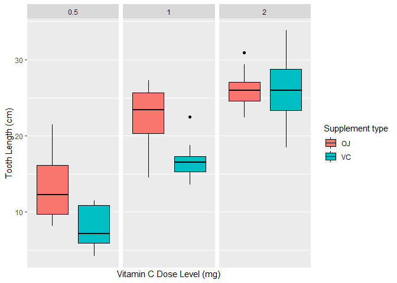

# Introduction

The data used in the following analysis is from the `ToothGrow` dataset in the default `datasets` package. The title of the dataset is *The Effect of Vitamin C on Tooth Growth in Guinea Pigs*. The description of the dataset, as quoted from the accompanying documentation is as follows:

The response is the length of odontoblasts (teeth) in each of 10 guinea pigs at each of three dose levels of Vitamin C (0.5, 1.0, and 2.0 mg) with each of two delivery methods (orange juice or ascorbic acid).

# Exploratory Data Analysis

To begin the analysis we review the data taking a sample and seeing how it is structured (table 1, 2 and 3).


Table: Table 1: Sample of data set ToothGrowth

 **len**    **supp**    **dose** 
---------  ----------  ----------
   4.2         VC         0.5    
  11.5         VC         0.5    
   7.3         VC         0.5    
   5.8         VC         0.5    
   6.4         VC         0.5    
  10.0         VC         0.5    
  11.2         VC         0.5    
  11.2         VC         0.5    
   5.2         VC         0.5    
   7.0         VC         0.5    


Table: Table 2: Structure of the data set ToothGrowth

          **len**      **supp**        **dose**  
---  ---------------  ----------  ---------------
      Min.   : 4.20     OJ:30      Min.   :0.500 
      1st Qu.:13.07     VC:30      1st Qu.:0.500 
      Median :19.25       NA       Median :1.000 
      Mean   :18.81       NA       Mean   :1.167 
      3rd Qu.:25.27       NA       3rd Qu.:2.000 
      Max.   :33.90       NA       Max.   :2.000 


Table: Table 3: Class of the data set ToothGrowth

             **len**    **supp**    **dose** 
----------  ---------  ----------  ----------
**class**    numeric     factor     numeric  

When plotting box diagrams (figure 1) for each dose and type of supplement, we see how the dose level correlates with the length of the tooth, regardless of the type of supplement. We can also see that the method of administration has an impact, although this becomes less pronounced as the dose increases.


<div class="figure" style="text-align: center">

<p class="caption">Boxplot Tooth Length</p>
</div>


# Hypothesis Testing

To assess whether the ideas extracted from the exploratory analysis are statistically valid, we performed T tests for the length of the teeth as a result of the type of supplement and the dose levels.

To narrow the analysis we will assume the following:

- The populations of guinea pigs are similar and were randomized to each condition.
- The variations between groups are different (or they are not known to be the same).


## Comparing of results through type of supplement

For this test, we ignore the dose and consider only the type of supplement as a predictor of tooth length, according to the following hypothesis:

> $H_{0}$: Tooth length is not affected by the type of supplement ($\mu_{OJ}$ = $\mu_{VC}$).


Table: Table 4: Comparing outcomes across delivery methods

                **p.value**    **conf.int.lower**    **conf.int.upper** 
-------------  -------------  --------------------  --------------------
**$H_{0}$:**       0.061             -0.171                7.571        

Because the p-value is greater than 0.05 and because the confidence interval crosses *zero* (-7.571, 0.171), we can not reject $H_{0}$ within a 95% confidence interval. This indicated that there is no strong evidence indicating a significant difference in tooth length between type of supplement.

## Comparing of results through the dose level

In this test, we only consider the dose level as a predictor of tooth length. We consider the following hypotheses:

> $H_{1}$: Tooth length is not affected by the 0.5 mg and 1.0 mg dose levels ($\mu_{0.5}$ = $\mu_{1.0}$)

> $H_{2}$: Tooth length is not affected by the 1.0 mg and 2.0 mg dose levels ($\mu_{1.0}$ = $\mu_{2.0}$)

> $H_{3}$: Tooth length is not affected by the 2.0 mg and 0.5 mg dose levels ($\mu_{2.0}$ = $\mu_{0.5}$)

We evaluated the hypothesis by performing three t tests, with the tooth length predicted by the dose level comparison. The results of these tests are summarized in Table 5.


Table: Table 5: Comparing outcomes across delivery methods

                **p.value**    **conf.int.lower**    **conf.int.upper** 
-------------  -------------  --------------------  --------------------
**$H_{1}$:**         0              -11.984                -6.276       
**$H_{2}$:**         0               -8.996                -3.734       
**$H_{3}$:**         0              -18.156               -12.834       

According to table 5 we can conclude that:

- For **$H_{1}$** : Because the p-value is less than 0.05 and the confidence interval does not cross by *zero*, we can reject $H_{1}$ for a confidence interval 95%.
- For **$H_{2}$** : Because the p-value is less than 0.05 and the confidence interval does not cross by *zero*, we can reject $H_{2}$ for a confidence interval 95%.
- For **$H_{3}$** : Because the p-value is less than 0.05 and the confidence interval does not cross by *zero*, we can reject $H_{3}$ for a confidence interval 95%.

## Comparing through type of supplement and dose levels

Now, we consider the effect of the type of supplement and the dose level. For this, we have the following hypotheses:

> $H_{4}$: Dose of 0.5 mg, the Tooth length is not affected by the type of supplement ($\mu_{OJ}$ = $\mu_{VC}$).

> $H_{5}$: Dose of 1.0 mg, the Tooth length is not affected by the type of supplement ($\mu_{OJ}$ = $\mu_{VC}$).

> $H_{6}$: Dose of 2.0 mg, the Tooth length is not affected by the type of supplement ($\mu_{OJ}$ = $\mu_{VC}$).

We evaluated these hypotheses by performing three t tests, with the tooth length predicted by the type of supplement in each dose level. The results of these tests are summarized in Table 6.


Table: Table 6: Comparing outcomes across delivery methods

                **p.value**    **conf.int.lower**    **conf.int.upper** 
-------------  -------------  --------------------  --------------------
**$H_{1}$:**       0.006             1.719                 8.781        
**$H_{2}$:**       0.001             2.802                 9.058        
**$H_{3}$:**       0.964             -3.798                3.638        

According to table 6 we can conclude that:

- For **$H_{4}$** : Because the p-value is less than 0.05 and the confidence interval does not cross by **zero**, we can reject $H_{4}$ for a confidence interval 95%
- For **$H_{5}$** : Because the p-value is less than 0.05 and the confidence interval does not cross by **zero**, we can reject $H_{5}$ for a confidence interval 95%
- For **$H_{6}$** : since the p-value is greater than 0.05 and the confidence interval crosses **zero** (-3.798,3.638), we can not reject the $H_{6}$ : within the 95% confidence interval.


# Conclusions

Based on the ideas extracted from the analysis performed, we conclude the following:

- There is no evidence that the size of the teeth varies according to the type of supplement independent of the dose level. But, there is evidence that it varies when the dose level is controlled at 0.5 mg or 1.0 mg.
- There is evidence that tooth length varies according to dose levels.

# Coding Reference

This code shows how the data is loaded and the data is shown in table 1.


```r
library(ggplot2)
library(dplyr)
library(knitr)
data <- ToothGrowth
colnames(data) <- paste0("**",names(data),"**")
knitr::kable(head(data,10), align = "c", caption = "Table 1: Sample of data set ToothGrowth")
```

Next, the code to generate table 2 is shown.


```r
knitr::kable(summary(data), align = "c", caption = "Table 2: Structure of the data set ToothGrowth")
```

This code generates table 3.


```r
a<-list()
for (i in 1:dim(ToothGrowth)[2]){
      a[i]<-class(ToothGrowth[,i])
}
c<- data.frame(t(a))
colnames(c) <- paste0("**",names(ToothGrowth),"**")
rownames(c) <- "**class**"
knitr::kable(c, align = "c", caption = "Table 3: Class of the data set ToothGrowth")
```

This code generates the graph of Figure 1.


```r
data <- ToothGrowth
Legend <- "Supplement type"
ylab <- "Tooth Length (cm)"
xlab <- "Vitamin C Dose Level (mg)"
g <- ggplot(data = data, aes(x = factor(supp), y = len, fill = supp)) +
      scale_fill_discrete(name = Legend) + geom_boxplot(col = "black") + 
      facet_wrap(~ dose) + scale_x_discrete(breaks=NULL) + xlab(xlab) +
      ylab(ylab)
g
```

The following is the code to generate the `t.test` of the tooth length vs the type of suplement and shows the results in table 4.


```r
test <- t.test(data = data, len ~ supp, paired = F, var.equal = F)
table <- cbind(test$p.value, test$conf.int[1], test$conf.int[2])
colnames(table) <- c("**p.value**", "**conf.int.lower**", "**conf.int.upper**")
rownames(table) <- "**$H_{0}$:** "
knitr::kable(table, align = "c", caption = "Table 4: Comparing outcomes across delivery methods", 
             digits = 3)
```

This code generates the `t.test` of tooth length vs each dose level for the two types of suplement and shows the results in table 5.


```r
data1 <- filter(data, dose == 0.5 | dose == 1.0)
data2 <- filter(data, dose == 1.0 | dose == 2.0)
data3 <- filter(data, dose == 2.0 | dose == 0.5)
test1 <- t.test(len ~ dose, data = data1, paired = F, var.equal = F)
test2 <- t.test(len ~ dose, data = data2, paired = F, var.equal = F)
test3 <- t.test(len ~ dose, data = data3, paired = F, var.equal = F)
table1 <- cbind(test1$p.value, test1$conf.int[1], test1$conf.int[2])
table2 <- cbind(test2$p.value, test2$conf.int[1], test2$conf.int[2])
table3 <- cbind(test3$p.value, test3$conf.int[1], test3$conf.int[2])
Tab <- rbind(table1, table2, table3)
colnames(Tab) <- c("**p.value**", "**conf.int.lower**", "**conf.int.upper**")
rownames(Tab) <- c("**$H_{1}$:** ", "**$H_{2}$:** ", "**$H_{3}$:** ")
knitr::kable(Tab, align = "c", caption = "Table 5: Comparing outcomes across delivery methods", 
             digits = 3)
```

Finally, this code generates the `t.test` of the tooth length vs the type of suplement for each dose level and shows the results in table 6.


```r
data1 <- filter(data, dose == 0.5)
data2 <- filter(data, dose == 1.0)
data3 <- filter(data, dose == 2.0)
test1 <- t.test(len ~ supp, data = data1, paired = F, var.equal = F)
test2 <- t.test(len ~ supp, data = data2, paired = F, var.equal = F)
test3 <- t.test(len ~ supp, data = data3, paired = F, var.equal = F)
table1 <- cbind(test1$p.value, test1$conf.int[1], test1$conf.int[2])
table2 <- cbind(test2$p.value, test2$conf.int[1], test2$conf.int[2])
table3 <- cbind(test3$p.value, test3$conf.int[1], test3$conf.int[2])
Tab <- rbind(table1, table2, table3)
colnames(Tab) <- c("**p.value**", "**conf.int.lower**", "**conf.int.upper**")
rownames(Tab) <- c("**$H_{1}$:** ", "**$H_{2}$:** ", "**$H_{3}$:** ")
knitr::kable(Tab, align = "c", caption = "Table 6: Comparing outcomes across delivery methods", 
             digits = 3)
```
